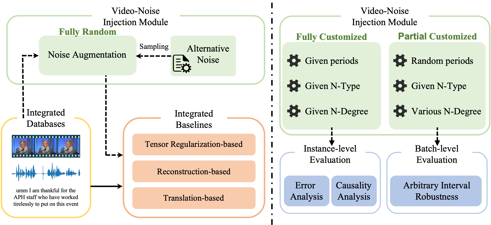
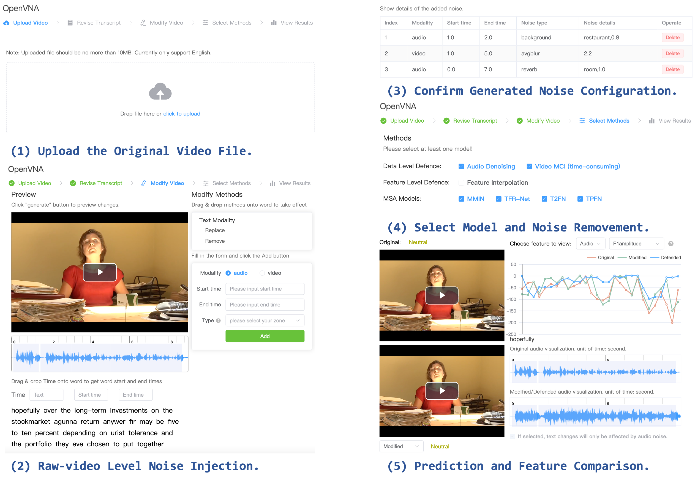

# OpenVNA: An Open-source Framework for Video Noise Analysis.

[](#License) 
[](https://pypi.org/project/MMSA-FET/) 

[](https://thuiar.github.io/)




## Noise Injection Apis

> The OpenVNA contains one of the most comprehensive video noise injection toolkits, covering the most cases in real world applications. Furthermore, the API facilitates the implementation of noise-based data augmentation techniques, offering researchers a versatile toolkit to enhance their investigations.

### Feature Level Noise Injection.

For feature level noise injection, random feature drop (random erasure of feature sequences with zero-padding vectors) and structural feature drop (erasing of feature sequences with zero-padding vectors in succession) are provided. Corresponding code is provided in ./feature_noise.py and some examples are shown in test_feat_noise.py.

```python
python test_feat_noise.py
```

### Raw Video Level Noise Injection.

For raw video level noise injection, eight categories of perturbations are supported. Corresponding code is provided in ./real_noise.py and some examples are shown in test_real_noise.py.

```python
python test_real_noise.py
```

## Modular Evaluaiton Pipeline

> The OpenVNA framework integrates eight baselines on two human-centered video understanding tasks into the standardized evaluation process. The modular pipeline makes it very easy to integrate new models for a reliable comparison with existing baselines. 

## Online Demonstration Platform

> The OpenVNA framework extends prior quantitative evaluation criteria to raw video-level noise. It also furnishes an interactive platform for evaluating at the instance level, encompassing case analysis and error analysis.

